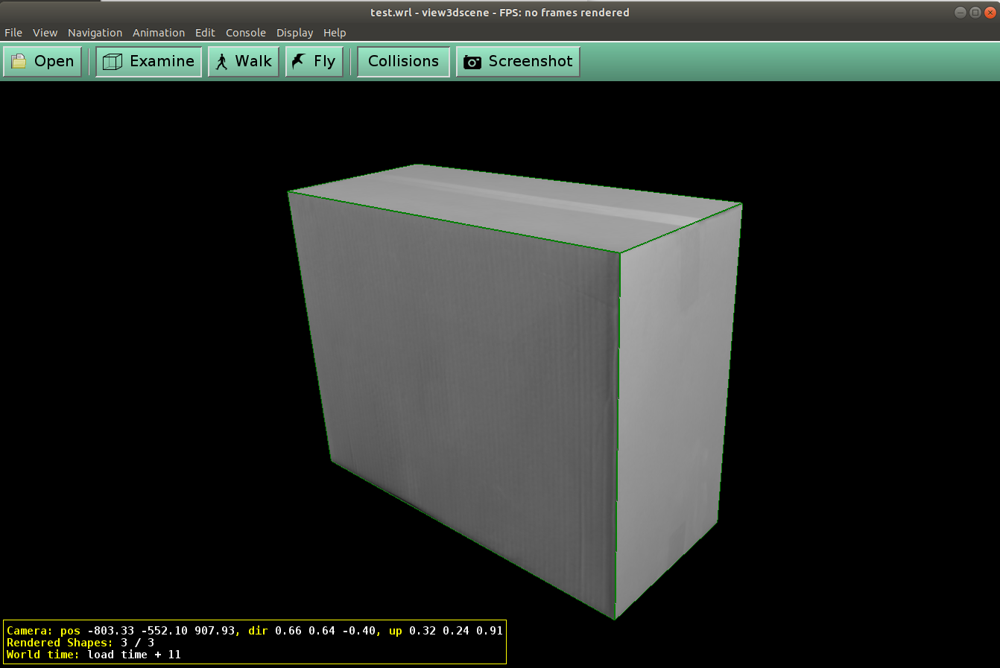

# Single View Metrology Project 

This project aims constructing a 3D model from a picture of a box using affine transformations inspired by the following paper:

*Criminisi, A. et al. "Single View Metrology". International Journal Of Computer Vision, vol 40, no. 2, 1999, pp. 123-148., Accessed 26 Nov 2019.*
[Link to paper](https://www.cs.cmu.edu/~ph/869/papers/Criminisi99.pdf)

At the time of the project, I believe the professor got his inspiration from the paper cited above, however the real inspiration seems to be of [this article](http://sklin93.github.io/svm.html). I found this article after compeleting the class and wasn't aware of this source during the project, so my code here is my own work. That article is better than what I have here, but is still nice to compare how close I was at the time. 

This project was broken into 2 parts. The first part was to create the box construction after manually providing the corners of the box in the image. The second part was to create a detector that would automatically calculate the locations of the corners so that one would have to manually find the corners of the box. This second part can be foudn in TestPerspective.m and 

A description of the files:
* Perspective.m: The main function that goes through the transformations
* CreateWRL.m: After the box faces are saved as separate images, this function formats a WRL file with the necessary formatting and data so that you can open it in a 3rd party viewer (like view3dscene)
* CreateLineVector.m: Calculates the line vector between 2 points
* input.bmp: The input image of a box
* TestPerspective.m: Run code to test the Perspective.m function and also is a script to calculate the corners using the Hough Tranform with manually tuned hyperparameters.
* SampleOutput: Contains output.wrl which can be opened by a 3rd party viewer like the [view3Dscene](https://castle-engine.io/view3dscene.php) program. You must have uv.bmp, uw.bmp, and vw.bmp in the same folder. If you don't want to use a 3rd party viewer, I also added WRL_in_view3dscene.png to show you what it would look like.

Input:

Output:

## Improvements
* Make it so the corner locator is more robust and will take other box images
* Automatically tune the Hough Transform hyperparameters so manual tuning is unnecessary.
